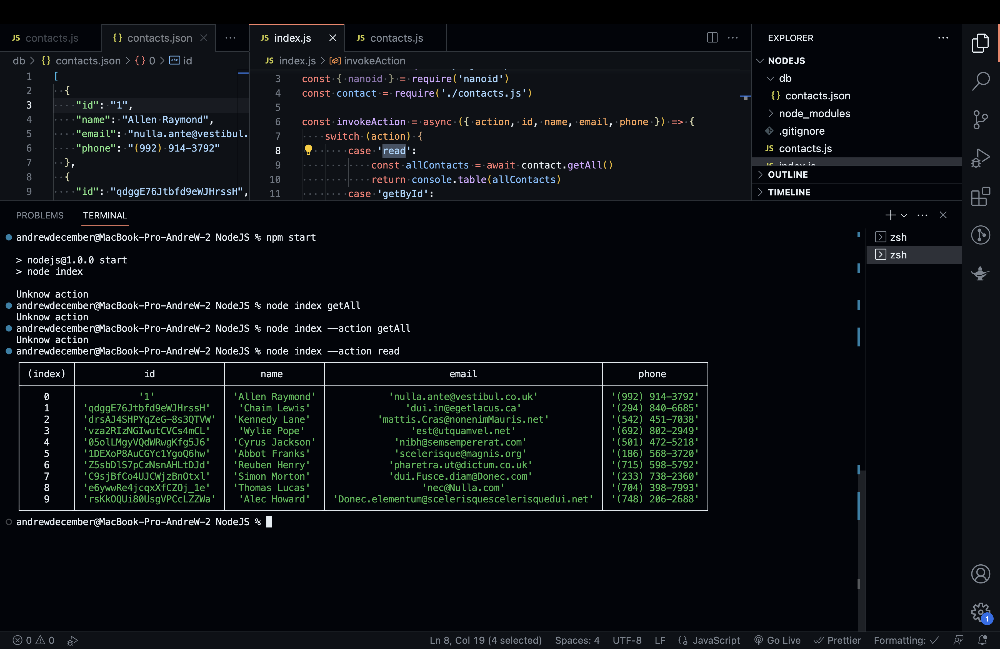
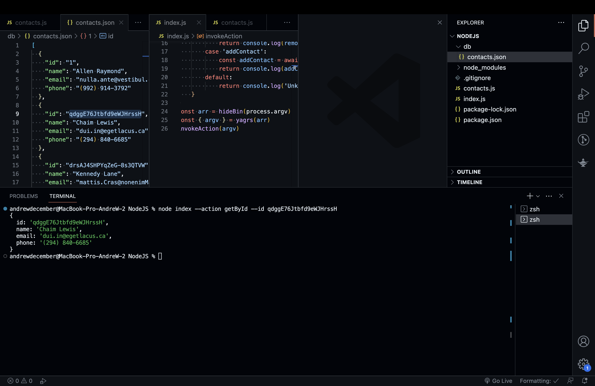
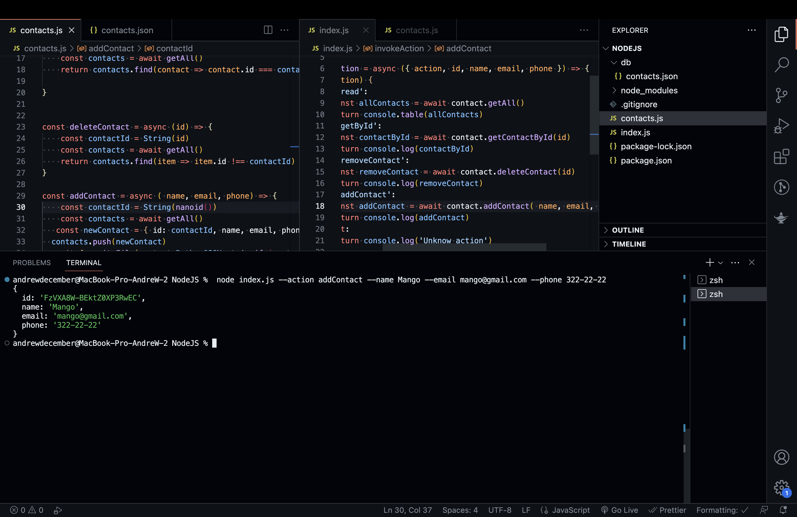
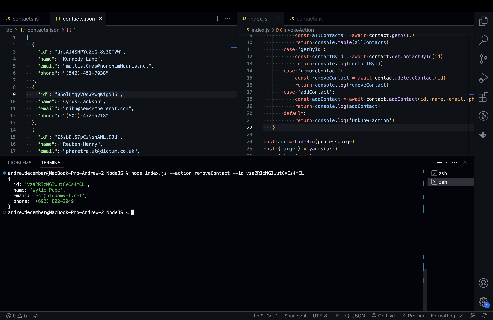

## Command execution

# Getting and displaying the list of contacts

node index -a list

 
http://surl.li/gvogf

# Get contact by id

node index -a get --id 05olLMgyVQdWRwgKfg5J6

 
http://surl.li/gvogr

# Add contact

node index -a add -n Mango -e mango@gmail.com -p 322-22-22

 
http://surl.li/gvofs

# Remove contact

node index -a remove -i qdggE76Jtbfd9eWJHrssH

 
http://surl.li/gvogx
